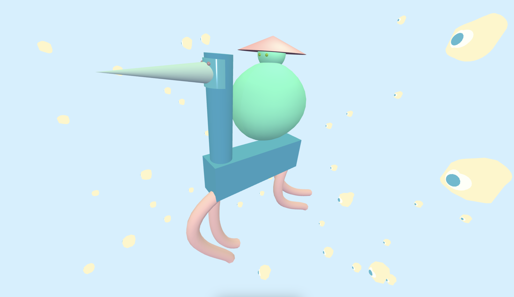
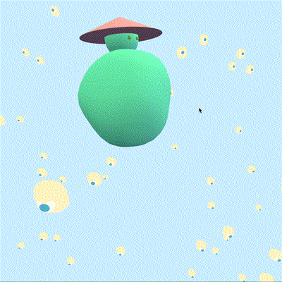
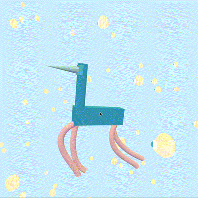
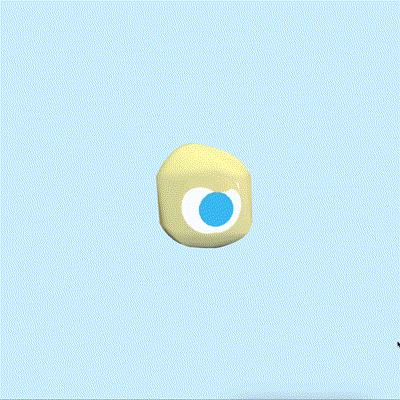

# Space travellers

## The story
The two very adventurous space travellers are the *spirit* and the *bird*. They are currently passing through the territory of the *space eggs* (not to be mistaken with SpaceX). But, do not worry! The space eggs are very nice, and they guide the travellers in the right direction.

*The spirit* is a courageous little guy, who has been travelling around different *spaces* in different universes for quite some time now. Therefore, he is a well-known visitor almost everywhere he goes. Although he met *the bird* not so long ago, and although the bird cannot really be described as someone experienced at going a lot here and there, they almost immediately got along very well. Since then, they have been adventuring together. 

And the *space eggs*? Well, they are pretty interesting creatures themselves, and definitely deserve a longer introduction, but this is now a task for another time.

## Meet each of the creatures

  

If you would like to *dive* into this universe, all you need is in the `./src` folder.

---
